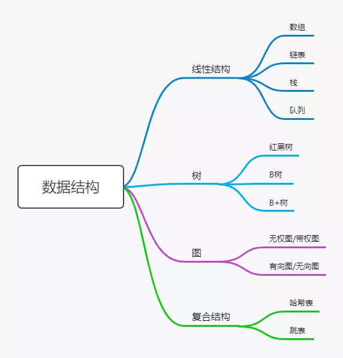

# chengxuyuanxiaohui
漫画算法代码片段GoLang实现

## 数据结构一览图

## 几种结构
| 结构 | 一 | 二 | 
| --- | --- | --- |
| 逻辑结构 | 线性结构 | 非线性结构 |
| eg | 顺序表、栈、队列 |树、图 |
| 物理结构 | 顺序存储结构 | 链式存储结构 | 
| eg | 数组 | 链表 |
| 存取结构 | 顺序存取 | 随机存取 |
| eg | 顺序表 | 链表 |